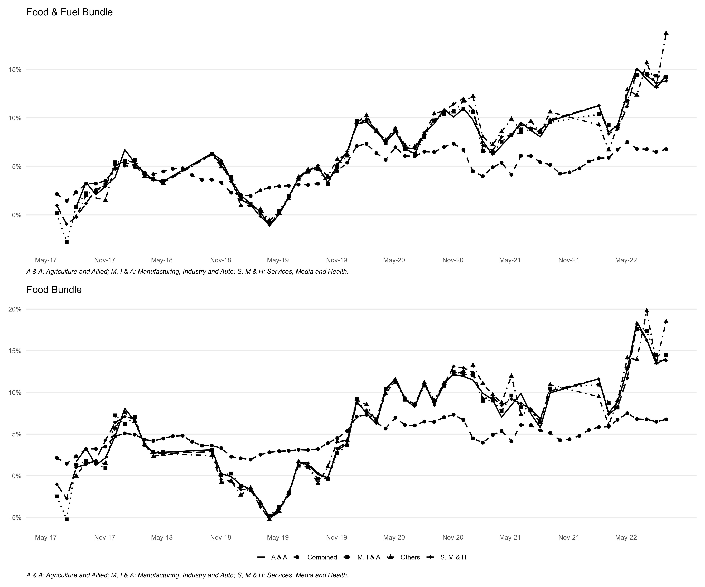
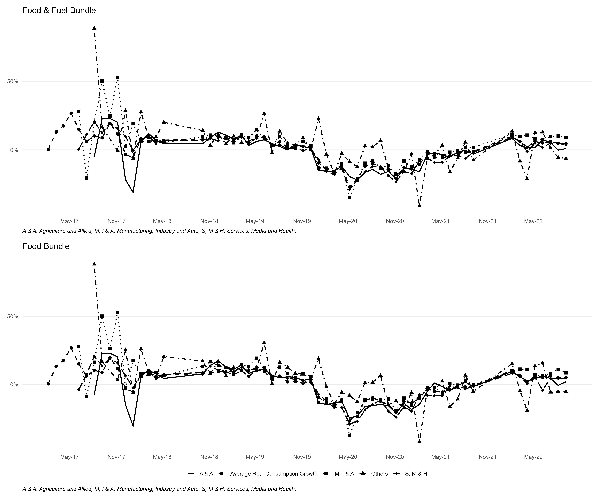

Extant literature calculates the household specific real consumption by deflating their nominal consumption through the aggregate CPI. Since, aggregate CPI only changes with time, and does not change across households; such a measure of real consumption only partially captures the cross sectional heterogeneity of the real consumption. It leads to the loss of potentially rich information content of the data especially for a country like India with a vast cross-sectional heterogeneity[^9]. To comprehend the information loss, we calculate the household specific price index from @eq-price using the monthly data of CPI for the food bundle, and food & fuel bundle. Consequently, we calculate the household specific y-o-y inflation rate for food bundle, and food & fuel bundle as follows - 

$$
\pi_{h(t+1)}^j=\ln \left(p_{h,(t+1)}^j\right)-\ln \left(p_{h,(t+1)-12)}^j\right)
$$ 

Next, we classify the households in 4 categories according to the occupation of their household heads, calculate the average inflation rate from May 2017 to October 2022, and plot them in @fig-mean_occup. Alongside the average inflation rate, @fig-mean_occup also plots the average inflation rate based on the aggregate CPI. While the upper panel of @fig-mean_occup plots the average inflation rates for the food bundle, the lower panel depicts the average inflations for the food \& fuel bundle. @fig-mean_occup shows that, the average inflation rate significantly varies across different types of households and also over time. 

::: {.content-visible when-format="pdf"}
{#fig-mean_occup height=150%}
:::

::: {.content-visible when-format="docx"}
{#fig-mean_occup height=150%}
:::

Since, households often change occupation over time,  we calculate the inflation rate after classifying the households according to the educational qualification, and the age of the household head. [@fig-mean_educ and @fig-mean_age]{.content-visible when-format="docx"}[@fig-mean_educ and @fig-mean_age]{.content-visible when-format="pdf"} (see appendix for figures) plot the average inflation rate from May 2017 to October 2022 for the Indian households classified according to the educational qualification, and the age of the household head respectively. Like @fig-mean_occup, [@fig-mean_educ and @fig-mean_age]{.content-visible when-format="docx"}[@fig-mean_educ and @fig-mean_age]{.content-visible when-format="pdf"} also portray the significant variation of the average inflation rate across different types of households

Next, to understand the cross-sectional heterogeneity in real consumption, we calculate a monthly household-specific expenditure-minimizing consumption bundle for food bundle, and for food & fuel bundle using @eq-basket. The expenditure-minimizing consumption bundles represent the household-specific real consumption in our paper. Note, such a measure of real consumption of the households incorporates the time-varying cross-sectional heterogeneity of both nominal consumption, and the price level, and thereby fully preserves the information content of the data relevant for forecasting [@lahiri_determinants_2016].

Using the measure of real consumption described above, we calculate its growth rate as follows:

$$
\Delta \ln \left(c_{h(t+1)}^j\right)=\Delta \ln \left(e_{h(t+1)}^j\right)+\Delta \ln \left(k_{h(t+1)}^j\right)-\pi_{h(t+1)}^j
$$

To understand the cross-sectional heterogeneity of consumption, we plot the average real consumption growth for the 4 categories of households, classifieds according to the occupation of their household head in @fig-mean_occup_chmt. Along with the disaggregated level of consumption expenditure for different types of households, @fig-mean_occup_chmt also plots the average aggregate real consumption growth for all the households. While the upper panel of @fig-mean_occup_chmt plots the average consumption growth for the food bundle, the lower panel depicts the same for the food \& fuel bundle. @fig-mean_occup_chmt shows- (i) the significant variation in consumption growth across the five types of households, and also over time, and (ii) the reduction in the average consumption growth for all types of households due to the Covid-19 pandemic. @fig-mean_occup_chmt also shows the slow recovery of the consumption of Indian households in the periods after the Covid-19 pandemic.  

[@fig-mean_educ_chmt and @fig-mean_age_chmt]{.content-visible when-format="docx"}[@fig-mean_educ_chmt and @fig-mean_age_chmt]{.content-visible when-format="pdf"} on the other hand, portray the average consumption growth from May 2017 to October 2022 when the households are classified according to the educational qualification, and the age of the household head. [@fig-mean_educ_chmt and @fig-mean_age_chmt]{.content-visible when-format="docx"}[@fig-mean_educ_chmt and @fig-mean_age_chmt]{.content-visible when-format="pdf"}(see appendix for figures) also depict significant time-varying cross sectional heterogeneity, and the slow recovery of the consumption growth from the Covid-19 pandemic shock for the Indian households. The significant time-varying cross sectional heterogeneity depicted in [@fig-mean_occup_chmt to @fig-mean_age_chmt]{.content-visible when-format="docx"}[@fig-mean_occup_chmt to @fig-mean_age_chmt]{.content-visible when-format="pdf"} show that, the average consumption growth for the Indian households has a definite pattern, and it is not random as predicted by the PIH as mentioned above in @eq-euler. Note in our expenditure minimizing consumption bundle, the time-varying cross-sectional heterogeneity of real consumption arises from the time-varying cross-sectional heterogeneity of the nominal consumption, and the household specific price level. Therefore, the expenditure minimizing consumption bundle used by us as a measure of real consumption, fully preserves the information content arising from the cross-sectional heterogeneity in household specific nominal consumption, and the household specific price level, which is relevant for better forecasting [@lahiri_determinants_2016].

::: {.content-visible when-format="pdf"}
{#fig-mean_occup_chmt height=150%}
:::

::: {.content-visible when-format="docx"}
{#fig-mean_occup_chmt height=150%}
:::

<!-- Footnotes -->

[^9]: The relative importance of different commodities in the consumption basket varies over time, and across individuals belonging to the different socioeconomic strata of the society. As a result, the incidence of inflation also varies across individuals and over time. Ignoring the changing relative importance of different commodities for different groups of people yields a Plutocratic bias of the CPI [@nachane2019plutocratic]. A disaggregated household specific price level can address the Plutocratic bias associated with aggregate price index. 