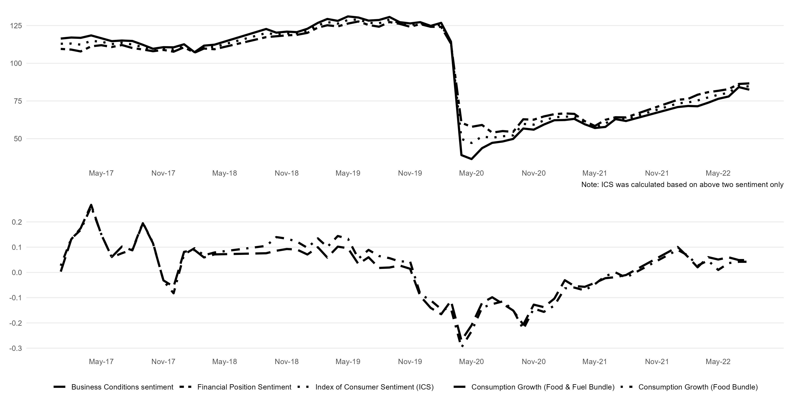

This section examines the relationship between the aggregate consumption growth, and the aggregate sentiments for India from May 2017 to October 2022. To do so, we calculate an Index of Consumer Sentiments (ICS) for India using the average of the balance statistics of the sentiments associated with – (i) the year ahead household’s own future financial positions (question III of CPHS), and (ii) the overall business condition of the economy (question IV of CPHS). The balance statistics of sentiments is calculated by adding 100 with the difference between the proportion of optimistic respondents and the pessimistic respondents for a given question. Note, when the proportion of optimistic respondents equals the proportion of the pessimistic household, the balance statistics of sentiments takes its baseline value 100. Similarly, when the proportion of optimistic respondents is more than the proportion of pessimistic respondents, the balance statistics of sentiments is higher than its baseline value 100, representing an overall optimistic sentiment for the economy, and vice-versa[^10].

The upper panel below plots the aggregate balance statistics for questions III and IV from May 2017 to October 2022, along with the ICS. The ICS is the average of the balance statistics of question III and question IV. It shows that the balance statistics for both questions III and IV, as well as the ICS, were more than 100 for India till May 2020. This represents an overall optimistic sentiment for Indian households in the pre-Covid period. However, all measures of household sentiments significantly fall below their baseline value of 100 due to the Covid-19 pandemic in May 2020. This represents the extent of overall pessimism and uncertainty as soon as the Covid-19 pandemic hits the Indian economy. The household sentiments, although rising, remain significantly below their baseline value till October 2022.

::: {.content-visible when-format="pdf"}
{#fig-ics height=150%}
:::

::: {.content-visible when-format="docx"}
{#fig-ics height=150%}
:::

While the upper panel of the figure above plots the sentiments, the lower panel depicts the aggregate consumption growth of India from May 2017 to October 2022, calculated on the basis of the food bundle and the food & fuel bundle, respectively. Note, the upper and the lower panel of the figure portrays a significant co-movement between the household sentiments and their consumption growth. It also shows that, along with the household sentiments, the Covid-19 pandemic also badly affects their consumption, from which the Indian households are yet to fully recover. Observing their co-movement, we calculate the correlation between the aggregate consumption growth with – (a) the balance statistics of question III, (b) the balance statistics of question IV, and (c) the ICS to assess their interrelationship. We find that the correlation coefficients are positive and significant at the 1% level[^11]. Note, both the figure above as well as the lower panel of the correlation matrix table portrays the lasting impact of the Covid-19 pandemic on the psyche and the spending decisions of the Indian households. To fully uncover their interrelationship, and to examine the predictive power of sentiments, we use a full-blown regression analysis based on the Euler equation framework in the next section.

## The Baseline OLS Estimation


## The GMM Estimation


## The Covid-19 Pandemic and the Role of Sentiments as Predictor of Consumption Growth 


## Consistency and the Spurious Excess Sensitivity - The Role of Forecast Error 


<!-- Footnotes -->
[^10]: See, @lahiri_determinants_2016 for the calculation of the balance statistics of sentiments.

[^11]: See, Correlation Matrix(@tbl-correlation) in the appendix.