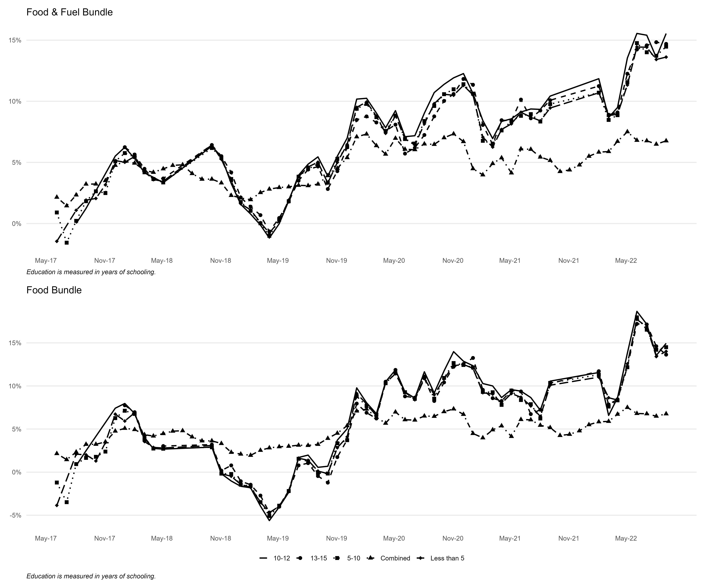
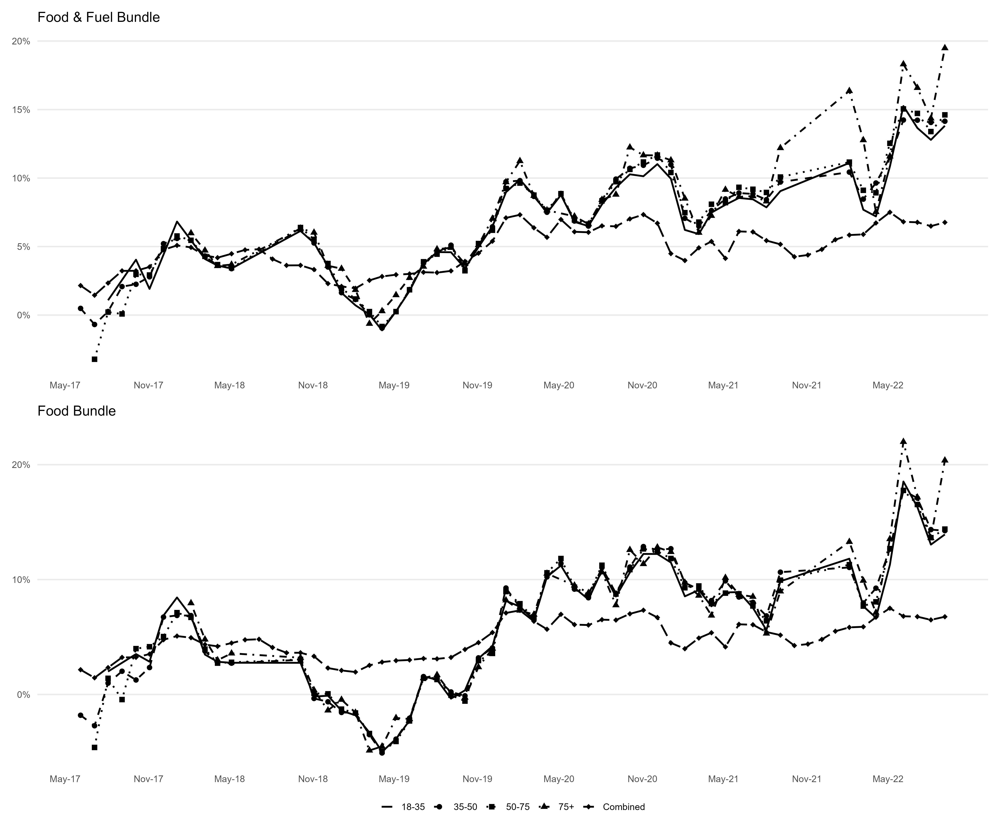
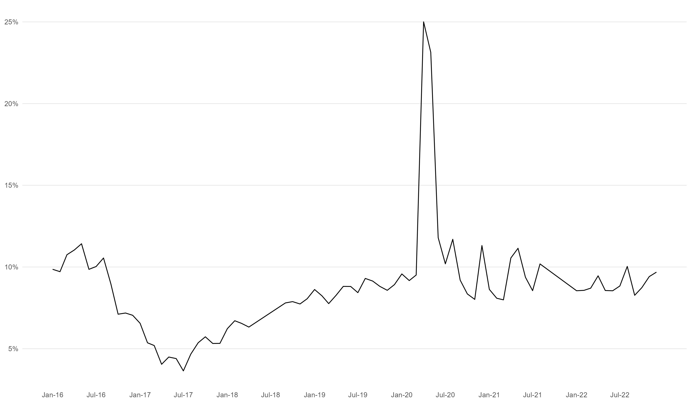

<!-- Figures PDF -->
<!-- Figure 2 -->
::: {.content-visible when-format="pdf"}
{#fig-mean_educ height=150%}
:::
<!-- Figure 3 -->
::: {.content-visible when-format="pdf"}
{#fig-mean_age height=150%}
:::

<!-- Figure 5 -->
::: {.content-visible when-format="pdf"}
{#fig-mean_educ_chmt height=150%}
:::

<!-- Figure 6 -->
::: {.content-visible when-format="pdf"}
{#fig-mean_age_chmt height=150%}
:::

<!-- unemploytment -->
::: {.content-visible when-format="pdf"}
{#fig-unemp height=150%}

\FloatBarrier
sourece:  "  nnnd"
\FloatBarrier
:::

<!-- Figures Word -->
<!-- Figure 2 -->
::: {.content-visible when-format="docx"}
{#fig-mean_educ height=150%}
:::

<!-- Figure 3 -->

::: {.content-visible when-format="docx"}
{#fig-mean_age height=150%}
:::

<!-- Figure 5 -->
::: {.content-visible when-format="docx"}
{#fig-mean_educ_chmt height=150%}
:::

<!-- Figure 6 -->
::: {.content-visible when-format="docx"}
{#fig-mean_age_chmt height=150%}
:::

<!-- unemployment -->
::: {.content-visible when-format="docx"}
{#fig-unemp height=150%}
:::